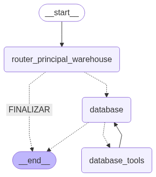

 
 
Basicamente a aplicação conta com 4 tools, dentro da 'database_tools'
 1 - Validação de sql
 2 - Coleta de esquema da base de dados postgreesql, porem foi usado sqlalchemy, caso queira alterar a base com mais facilidade
 3 - Execução da consulta sql, vale lembrar que caso a primeira etapa encontre problemas, é finalizado e o sql malicioso não é executado
 4 - Formatação de dados, atualmente string, mas poderia ser graficos.
 
## Estruturas das pastas e como navegar:
 
app/  
├── api/  
│ ├── v1/  
│ │ ├── endpoints/ # Rotas por recurso (ex: users.py, items.py)  
│ └── main.py # Inicialização da aplicação FastAPI  
│  
├── schemas/ # DTOs com Pydantic (entrada e saída de dados)  
│ ├── request  
│ └── response  
│  
├── domain/ # Camada de domínio (regras e lógica de negócio)  
│ ├── models/ # Entidades do domínio  
│ ├── services/ # Casos de uso / lógica de aplicação  
│ └── repositories/ # Interfaces abstratas de persistência  
│  
├── infrastructure/ # Implementações técnicas concretas  
│ ├── database/  
│ │ ├── repositories/ # Implementações dos repositórios  
│ │ └── session.py # Conexão e sessão com o banco  
│ └── external_services/ # Integrações com APIs externas, serviços, etc.  
│  
├── core/ # Configuração e utilitários globais  
│ ├── config.py # Variáveis de ambiente  
│ └── security.py # Autenticação, JWT, etc.  
│  
├── utils/ # Funções auxiliares e genéricas  
│ └── helpers.py  
│  
├── tests/ # Testes automatizados  
│ ├── unit/  
│ └── integration/  
│  

